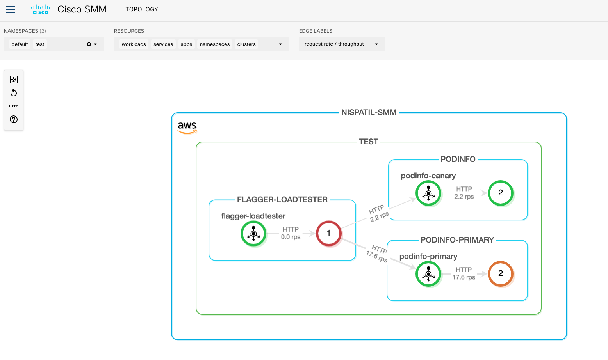
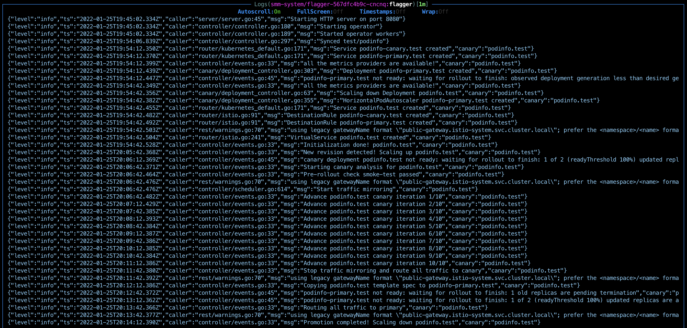
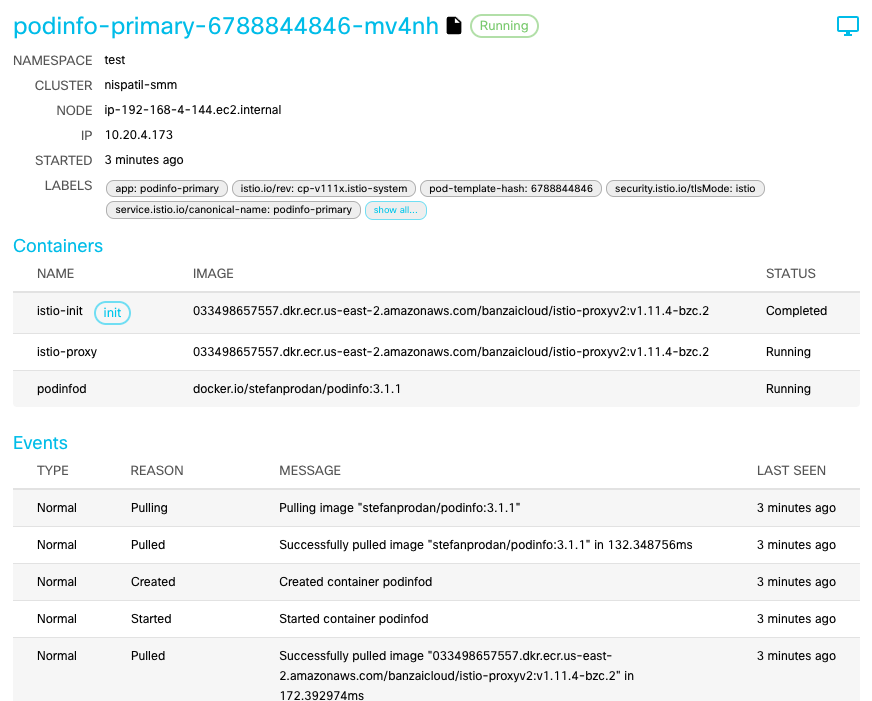

Flagger is Progressive Delivery Operator for Kubernetes that is designed to give developers confidence in  automating production releases with progressive delivery techniques.

A benefit of using Canary releases is its ability to do capacity testing of the new version in a production environment with a safe rollback strategy if issues are found.
By gradually increasing the traffic, you can monitor and capture metrics about how the new version impacts the production environment.

Flagger can run automated application testing for following deployment strategies:
- Canary (progressive traffic shifting)
- A/B testing (HTTP headers and cookie traffic routing)
- Blue/Green (Traffic switching mirroring)

`Reference`
[Flagger user guide](https://docs.flagger.app/)

The below example show us how Flagger can be integrated with SMM and observe Progressive delivery on SMM Dashboard.
We will configure and deploy `podinfo` application for Blue/Green traffic mirror testing, upgrade its version and watch the Canary release on SMM WebUI.

# SMM - Flagger Integration

- [SMM - Flagger Integration](#smm---flagger-integration)
    - [Setup Flagger](#setup-flagger)
    - [Create Target - Tester Deployment](#create-target---tester-deployment)
    - [Create IngressGW and Canary CR](#create-ingressgw-and-canary-cr)
    - [Generate HTTP traffic](#generate-http-traffic)
    - [Upgrade Image Version](#upgrade-image-version)
    - [Automated Rollback](#automated-rollback)
    - [Screenshots](#screenshots)
    - [Source](#source)

## Setup Flagger

Deploy Flagger in smm-system namespace and connect to Istio and Prometheus to SMM at Prometheus address as shown in below command

```
$ kubectl apply -f https://raw.githubusercontent.com/fluxcd/flagger/main/artifacts/flagger/crd.yaml
$ helm upgrade -i flagger flagger/flagger \
--namespace=smm-system \
--set crd.create=false \
--set meshProvider=istio \
--set metricsServer=http://smm-prometheus.smm-system.svc.cluster.local:59090/prometheus
```

Note: Make sure you see below log for successful flagger operator deployment in your SMM cluster

`{"level":"info","ts":"2022-01-25T19:45:02.333Z","caller":"flagger/main.go:200","msg":"Connected to metrics server http://smm-prometheus.smm-system.svc.cluster.local:59090/prometheus"}`

## Create Target - Tester Deployment

Create namespace "test" and enable auto sidecar injection on "test" namespace
```
$ kubectl create ns test
namespace/test created

$ ./smm-cli sp ai on test
logged in as kubernetes-admin
INFO[0006] auto sidecar injection successfully set to namespace
```

Deploy "podinfo" target image that needs to be enabled for canary deployment and "tester" for loadtesting during Automated canary promotion

```
$ kubectl apply -k https://github.com/fluxcd/flagger//kustomize/podinfo?ref=main
$ kubectl apply -k https://github.com/fluxcd/flagger//kustomize/tester?ref=main
```

## Create IngressGW and Canary CR

Create an ingress gateway to expose the demo app outside of the mesh
Copy the below yaml and save it as `podinfo_gateway.yaml` and apply it using `kubectl`

```
apiVersion: networking.istio.io/v1alpha3
kind: Gateway
metadata:
  name: public-gateway
  namespace: istio-system
spec:
  selector:
    istio: ingressgateway
  servers:
    - port:
        number: 80
        name: http
        protocol: HTTP
      hosts:
        - "*"
```

Create Canary custom resource
Copy the below yaml and save it as `podinfo_canary.yaml` and apply it using `kubectl`

```
apiVersion: flagger.app/v1beta1
kind: Canary
metadata:
  name: podinfo
  namespace: test
spec:
  # deployment reference
  targetRef:
    apiVersion: apps/v1
    kind: Deployment
    name: podinfo
  # the maximum time in seconds for the canary deployment
  # to make progress before it is rollback (default 600s)
  progressDeadlineSeconds: 60
  # HPA reference (optional)
  autoscalerRef:
    apiVersion: autoscaling/v2beta2
    kind: HorizontalPodAutoscaler
    name: podinfo
  service:
    # service port number
    port: 9898
    # container port number or name (optional)
    targetPort: 9898
    # Istio gateways (optional)
    gateways:
    - public-gateway.istio-system.svc.cluster.local
    # Istio virtual service host names (optional)
    hosts:
    - app.example.com
    # Istio traffic policy (optional)
    trafficPolicy:
      tls:
        # use ISTIO_MUTUAL when mTLS is enabled
        mode: DISABLE
    # Istio retry policy (optional)
    retries:
      attempts: 3
      perTryTimeout: 1s
      retryOn: "gateway-error,connect-failure,refused-stream"
  analysis:
    # schedule interval (default 60s)
    interval: 30s
    # max number of failed checks before rollback
    threshold: 3
    # number of checks to run before rollback
    iterations: 10
    # Prometheus checks based on
    # http_request_duration_seconds histogram
    mirror: true
    # weight of the traffic mirrored to your canary (defaults to 100%)
    mirrorWeight: 100
    metrics:
      - name: request-success-rate
        # minimum req success rate (non 5xx responses)
        # percentage (0-100)
        thresholdRange:
          min: 99
        interval: 1m
      - name: request-duration
        # maximum req duration P99
        # milliseconds
        thresholdRange:
          max: 500
        interval: 30s
    # acceptance/load testing hooks
    webhooks:
      - name: smoke-test
        type: pre-rollout
        url: http://flagger-loadtester.test/
        timeout: 15s
        metadata:
          type: bash
          cmd: "curl -sd 'anon' http://podinfo-canary.test:9898/token | grep token"
      - name: load-test
        url: http://flagger-loadtester.test/
        timeout: 5s
        metadata:
          type: cmd
          cmd: "hey -z 1m -q 10 -c 2 http://podinfo-canary.test:9898/"

```

Wait until flagger initializes the deployment

`{"level":"info","ts":"2022-01-25T19:54:42.528Z","caller":"controller/events.go:33","msg":"Initialization done! podinfo.test","canary":"podinfo.test"}`

## Generate HTTP traffic

Send some trafic to podinfo-primary  to view topology on smm dashboard

```
$ kubectl -n test exec -it deploy/flagger-loadtester sh

/home/app $ hey -z 30m -q 10 -c 2 http://podinfo-primary.test:9898

```

## Upgrade Image Version

Upgrade the target image with new version and watch the canary functionality on SMM dashboard

```
$ kubectl -n test set image deployment/podinfo podinfod=stefanprodan/podinfo:3.1.1
deployment.apps/podinfo image updated
```
Verify that flagger has identified new version change and  canary deployment process starts

`{"level":"info","ts":"2022-01-25T20:05:42.368Z","caller":"controller/events.go:33","msg":"New revision detected! Scaling up podinfo.test","canary":"podinfo.test"}`

Repeat this step for all other versions of `stefanprodan/podinfo` images

## Automated Rollback

If you would like to test automated rollback if a canary fails, Generate status 500 and delay using below command on tester pod and watch how Canary release fails.

```
$ kubectl -n test exec -it deploy/flagger-loadtester sh
/home/app $ watch "curl http://podinfo-canary:9898/delay/1 && curl http://podinfo-canary:9898/status/500"
```

## Screenshots
SMM Dashboard provides you with live canary deployment progress with traffic updates



Check the progress of your canary deployment in flagger logs



You can also check the image version after image rollout completes



## Delete Flagger
Remove Gateway and Canary CR
```
$ kubectl delete -f podinfo_gateway.yaml
$ kubectl delete -f podinfo_canary.yaml
```

Remove Target and tester deployment
```
$ kubectl delete -k https://github.com/fluxcd/flagger//kustomize/podinfo?ref=main
$ kubectl delete -k https://github.com/fluxcd/flagger//kustomize/tester?ref=main
```

Remove Istio auto side-car injection from "test" namespace
```
$ ./smm-cli sp ai off test
logged in as kubernetes-admin
INFO[0006] auto sidecar injection successfully removed from namespace
```

Delete "test" namespace
```
$ kubectl delete ns test
```

Delete Flagger deployment and Canary CRD 
```
$ helm delete flagger -n smm-system
release "flagger" uninstalled
$ kubectl delete -f https://raw.githubusercontent.com/fluxcd/flagger/main/artifacts/flagger/crd.yaml
```
