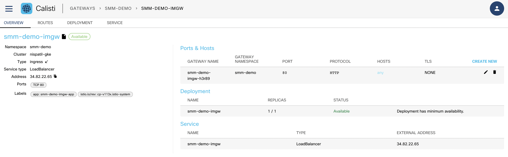
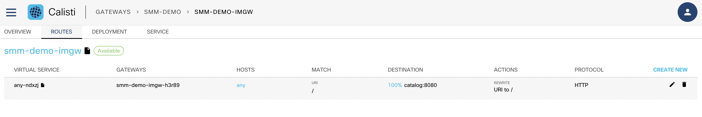

# CLI Traffic Generator in smm-demo

To generate traffic from CLI we will use "hey - traffic generator"

There are two ways you can generate traffic for smm-demo service from CLI
1. Generate traffic from within the cluster or anywhere in cloud where a container can be run with public network access
2. Generate traffic from you personal laptop


## Generate traffic from within the cluster

Deploy networktools container in smm-demo namespace
```
kubectl -n smm-demo run networktools -it --image=nishantapatil3/networktools:latest -- /bin/sh
```

Send traffic to frontpage, catalog, bookings etc
```
hey -z 30m -q 10 -c 2 http://catalog.smm-demo:8080/

Replace catalog with service that you want to send traffic to
```
Note: To stop traffic "ctrl+c"

Delete networktools pod after your traffic generation
```
kubectl delete pod -n smm-demo networktools
```

## Generate traffic from you personal laptop

To install "hey" on Mac/Linux (prereq homebrew)
```
brew install hey
```

Example:
```
❯ brew install hey
Warning: Treating hey as a formula. For the cask, use homebrew/cask/hey
Warning: hey 0.1.4 is already installed and up-to-date.
To reinstall 0.1.4, run:
  brew reinstall hey

❯ hey --help
Usage: hey [options...] <url>

Options:
  -n  Number of requests to run. Default is 200.
  -c  Number of workers to run concurrently. Total number of requests cannot
      be smaller than the concurrency level. Default is 50.
  -q  Rate limit, in queries per second (QPS) per worker. Default is no rate limit.
  -z  Duration of application to send requests. When duration is reached,
      application stops and exits. If duration is specified, n is ignored.
      Examples: -z 10s -z 3m.
...
...
```

Apply ingressmeshgateway to your cluster to accept incoming taffic to smm-demo ns
```
kubectl apply -f - << EOF
apiVersion: servicemesh.cisco.com/v1alpha1
kind: IstioMeshGateway
metadata:
  annotations:
    banzaicloud.io/related-to: istio-system/cp-v113x
  labels:
    app: smm-demo-imgw-app
    istio.io/rev: cp-v113x.istio-system
  name: smm-demo-imgw
  namespace: smm-demo
spec:
  deployment:
    podMetadata:
      labels:
        app: smm-demo-imgw-app
        istio: ingressgateway
  istioControlPlane:
    name: cp-v113x
    namespace: istio-system
  service:
    ports:
      - name: http
        port: 80
        protocol: TCP
        targetPort: 8080
    type: LoadBalancer
  type: ingress
EOF
```

Setup http gateway on SMM WebUI as shown in below image


Setup virtualservice on SMM WebUI as shown in below image


Get the ingress IP of your cluster where SMM is installed
```
export INGRESS_IP=$(kubectl get istiomeshgateways.servicemesh.cisco.com -n smm-demo smm-demo-imgw -o jsonpath='{.status.GatewayAddress[0]}')
echo $INGRESS_IP
```

Run hey traffic generator, this commands sends http requests to target IP
```
hey -z 30m -q 10 -c 2 http://$INGRESS_IP/
```

change the parameters for -z, -q etc as per your requirements

